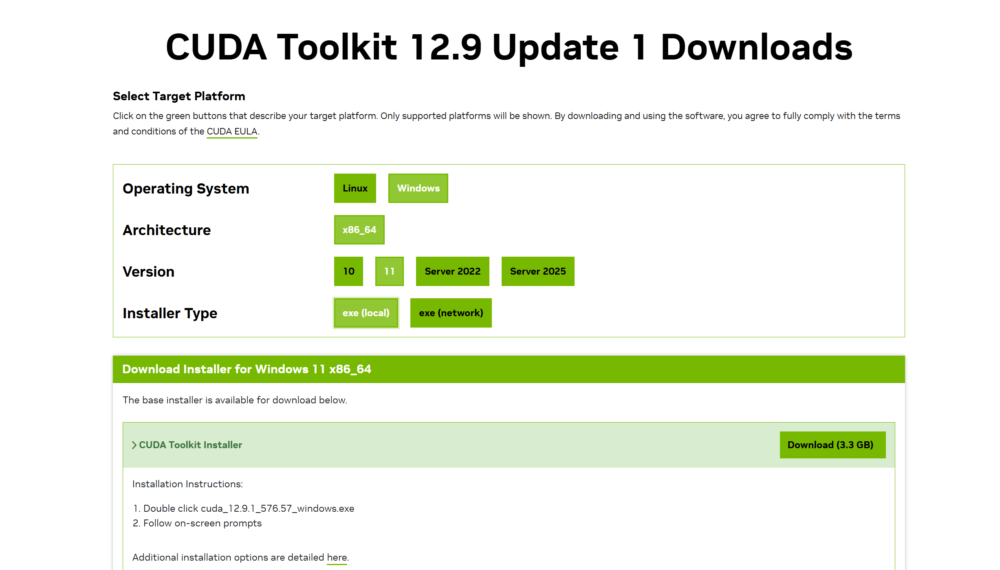
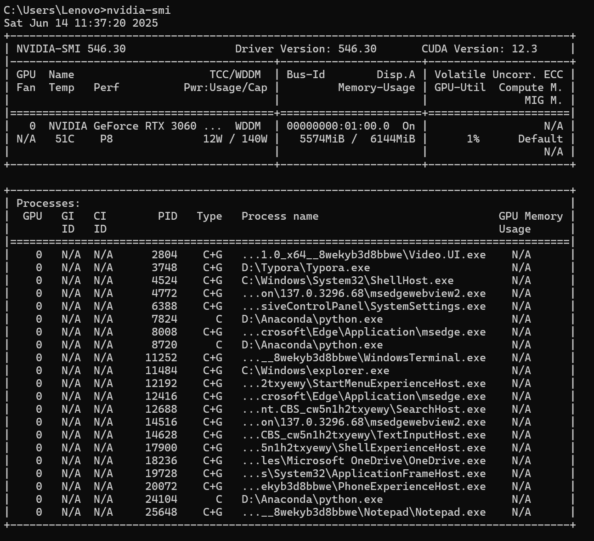

# 大模型（LLMs）微调训练 快速入门指南

  


## 项目概述

本项目旨在介绍大模型微调相关算法，并以开源模型 Qwen3-0.6B 为例展开，实现了 Lora、P-tuning 等微调算法，同时涵盖模型增量预训练、GPTQ/AWQ 等量化操作，并提供了对应的完整代码实现。

## 拉取代码

大家可以克隆仓库到本地或者服务器上运行

```
git clone https://github.com/huangxiaoye6/LLM-tuning.git
```


## 搭建开发环境

本项目对于硬件有一定要求，GPU显存不少于6G，否则可能没办法进行训练。

建议使用云服务器进行模型训练和微调。

- Python环境管理  [uv](https://docs.astral.sh/uv/)

- Python交互式开发环境  [jupyter notebook](https://jupyter.org/)

- LLM开源模型  [Qwen/Qwen3-0.6B](https://huggingface.co/Qwen/Qwen3-0.6B)


**以下是详细的安装指导（以 Window11操作系统为例）**：

### 安装 CUDA Toolkit 和 GPU 驱动

根据你的实际情况，找到对应的 [CUDA 12.04](https://developer.nvidia.com/cuda-downloads?target_os=Linux&target_arch=x86_64&Distribution=Ubuntu&target_version=22.04&target_type=runfile_local)：

下载并安装 CUDA 12.4 Toolkit（包含GPU驱动）：




安装完成后，使用 `nvidia-smi` 指令查看版本和显存大小：



### 安装 uv 环境管理工具

```python
pip install uv
```

### 安装指定Python版本

```
uv python install 3.10
```

### 安装项目依赖

```
uv sync
```

## 微调算法对比

### 1. 全量微调

- **原理**：对模型的所有参数进行更新训练，需要大量的计算资源和时间。
- **优点**：能够充分利用数据，可能得到更好的模型性能。
- **缺点**：计算资源消耗大，训练时间长，可能需要大量的显存。
- **适用场景**：当有足够的计算资源和时间，且数据量较大时适用。

### 2. LoRa 微调

- **原理**：在不改变预训练模型原有参数的基础上，通过在模型的某些层添加可训练的低秩自适应（LoRA）矩阵，只对这些矩阵进行训练。
- **优点**：减少了可训练参数的数量，降低了计算资源的需求，训练速度相对较快。
- **缺点**：性能提升可能不如全量微调。
- **适用场景**：计算资源有限，希望在较短时间内完成微调时适用。

### 3. QLoRa 微调

- **原理**：结合了量化技术和 LoRA 技术，进一步减少了内存占用。
- **优点**：在保证一定性能的前提下，大幅降低了内存需求，使得在资源受限的情况下也能进行微调。
- **缺点**：可能会因为量化带来一定的精度损失。
- **适用场景**：计算资源极度受限，如在消费级 GPU 上进行微调时适用。


## Star History

[](https://www.star-history.com/#huangxiaoye6/LLM-tuning&type=date&legend=top-left)
